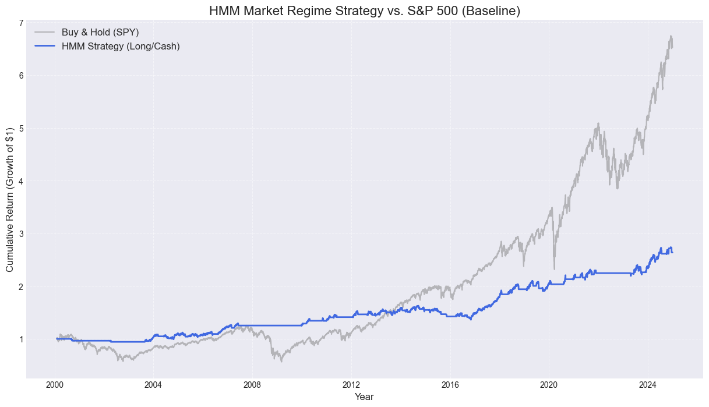
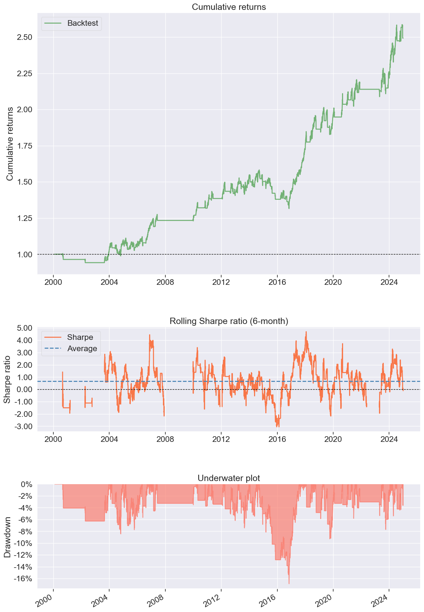
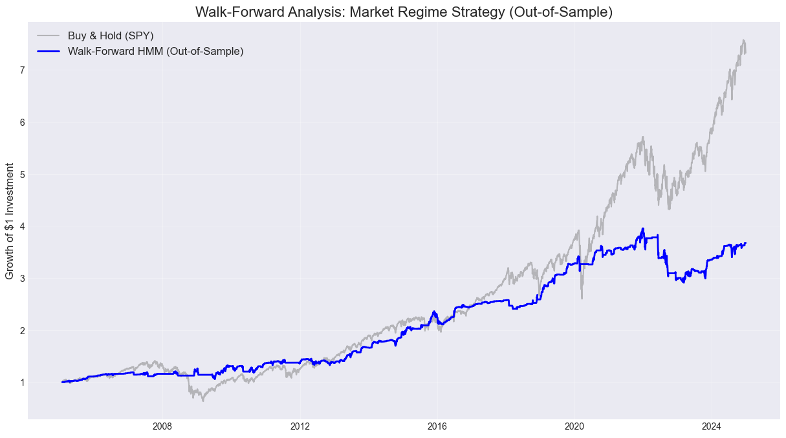

# 📈 Walk-Forward Market Regime Detection
### *Statistical Learning for S&P 500 Defensive Allocation*

[](https://www.python.org)
[](https://hmmlearn.readthedocs.io/)

## 1. Project Overview
This project implements a **Hidden Markov Model (HMM)** to decode latent market regimes—specifically identifying "Bull," "Bear," and "High Volatility" states—to dynamically adjust portfolio exposure. 

To achieve professional-grade reliability, the analysis utilizes a **Walk-Forward Engine**. Unlike static backtests that suffer from look-ahead bias, this model re-trains every 10 days using only past data, simulating a true production environment.

> **Objective:** Act as a "Volatility Shield," minimizing Maximum Drawdown while maintaining a superior Sharpe Ratio compared to a passive S&P 500 benchmark.


---

## 2. Quantitative Architecture
The project is structured as a **discovery journey**, moving from feature engineering to institutional-grade risk reporting.

* **Feature Engineering:** Utilizes Log-Returns and 21-day Rolling Volatility to capture market dynamics. 
* **Mathematical Stabilization:** * **In-Loop Scaling:** Employs `StandardScaler` within the walk-forward loop to prevent data leakage and ensure model convergence.
    * **Numerical Convergence:** Configured with `min_covar` and `full` covariance types to handle market noise and prevent matrix singularity.
* **Algorithm:** Gaussian HMM with 3 Hidden States (representing various volatility regimes).
* **Validation:** Expanding-window Walk-Forward Analysis with a 1,250-day "burn-in" training period.


---

## 3. Performance Metrics
### **Out-of-Sample Results (2005–2024)**
The strategy successfully transformed the S&P 500's risk profile, reducing annual volatility by **~55%**.



| Metric | Walk-Forward HMM | Buy & Hold (SPY) |
| :--- | :--- | :--- |
| **Sharpe Ratio** | **0.76** | 0.52 |
| **Annual Volatility** | **8.60%** | 19.07% |
| **Total Return** | 267.54% | **632.69%** |
| **Max Drawdown** | **-16.88%** | -55.19% |

### **Institutional Tear Sheet (PyFolio)**
The baseline institutional analysis confirms high stability and efficient downside risk management.

* **Crisis Alpha:** Successfully identified and exited during the **2008 Financial Crisis** and **2020 COVID Crash**.
* **Stability:** Achieved a consistency score of **0.95**.
* **Risk Management:** Maintained a Daily Value at Risk (VaR) of only **-0.831%**.



---

## 4. Key Discovery Insights
1.  **The Volatility Shield:** The HMM effectively trades off total upside for extreme capital preservation. 
2.  **The Necessity of Scaling:** Standardizing features was the primary fix for the "Model not converging" errors encountered during initial development.
3.  **The "Gap":** Moving from a Baseline (In-Sample) to a Walk-Forward (Out-of-Sample) model revealed more modest, but significantly more trustworthy, results.

---

## 5. How to Run
1.  **Clone the Repo:** ```bash
    git clone [https://github.com/your-username/HMM-Regime-Detection.git](https://github.com/your-username/HMM-Regime-Detection.git)
    ```
2.  **Install Requirements:**
    pandas numpy matplotlib hmmlearn sklearn pyfolio
    
3.  **Execute:** Run `main.ipynb` to view the step-by-step discovery and Walk-Forward simulation.
